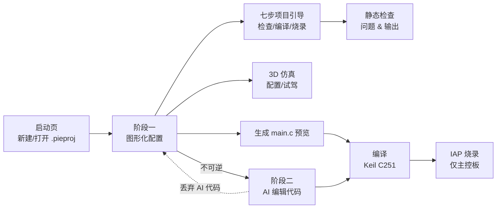

# pie-block

面向 W.PIE RoboMaster 校内赛的机器人控制程序生成器。

用户是做机械结构的大一学生，没有编程基础。他们在图形化界面里描述自己的机器人
（引脚接了什么、按键怎么映射、机械臂有几个关节），程序生成可直接编译的 STC32G
`main.c`，再调用内置 Keil C251 工具链编译成 hex。

技术栈：Godot 4.7（GDScript）+ Keil C251（精简版，随程序分发）+ ttyd/WRY（内嵌 AI 终端）。

## 工作流



项目文件 `.pieproj` 是自包含的 JSON 单文件，可以直接拷给同学。阶段一 → 阶段二单向推进，
降回阶段一的唯一代价是丢弃 AI 编辑的代码。

## 已有功能

### 项目管理

- 启动页新建 / 打开项目，最近打开列表（含类型与阶段标签，读不出来的条目自动摘除）
- 三种项目类型：步兵、工程、调试。类型新建时定死，不可转换
- 类型决定可见标签页（`KIND_TABS`：步兵 `[0]`、工程 `[1,2]`、调试 `[3]`）
- 配置快照通用序列化：遍历配置区所有 `LineEdit` / `OptionButton` / 可切换按钮，
  key 用相对节点路径，加控件无需改代码
- 两阶段状态机：阶段二在图形化界面是只读预览，任何改动会先整份回滚再弹确认
- 未保存改动提醒、脏标记标题（`* 项目名 · 构型 · 阶段`）

相关文件：[scripts/project_file.gd](scripts/project_file.gd)、[scripts/launcher.gd](scripts/launcher.gd)、[scripts/app_state.gd](scripts/app_state.gd)

### 图形化配置与静态检查

- 主界面七步项目引导：进入配置前强制确认只烧录主控板，
  再完成输入配置、执行机构配置、检查与仿真、编译、烧录主控板、真机低速测试；
  独立引导场景由图形化配置页和 AI 编辑页共同复用，步骤直接连接各页面的真实操作入口
- 检查、编译、烧录状态按当前代码 SHA-256 记录，配置变化后旧结果自动失效
- 七步引导的红绿完成状态保存在 `.pieproj` 的 `workflow.guide_completed` 中，拷贝或重开项目后继续显示
- 遥控器（通道号、死区）、底盘（4 路电机 IO + 方向 + 普通/冲刺速度）
- 步兵云台：Yaw / Pitch 可选电机或舵机、摩擦轮 P64/P66、拨弹、按键映射、归中角
- 工程：8 个扩展板引脚 + 主控板 MP03/MP74 的驱动类型初始化，右摇杆与
  A/B/C/D/方向键/R 自由映射到任意 IO，四种控制模式（增量 / 直接 / 速度 / 增速）
- 调试：逐引脚自检序列，每步 3 秒、蜂鸣器提示前后音
- 静态检查覆盖数值越界、引脚重复占用、MP74/MP03 只能驱动舵机、按键冲突、
  摩擦轮引脚被挪用等几十条规则，Error / Warn 分级并在输出框着色

相关文件：[scripts/ui.gd](scripts/ui.gd)、[scripts/output.gd](scripts/output.gd)

### 代码生成

四个生成器共用 [scripts/codegen/codegen_base.gd](scripts/codegen/codegen_base.gd) 的引脚映射、按键宏映射、舵机占空比换算：

| 生成器 | 说明 |
| --- | --- |
| [codegen_infantry.gd](scripts/codegen/codegen_infantry.gd) | 步兵整车（底盘 / 云台 / 摩擦轮 / 单发拨弹） |
| [codegen_engineer.gd](scripts/codegen/codegen_engineer.gd) | 工程按键映射式控制 |
| [codegen_engineer_ik.gd](scripts/codegen/codegen_engineer_ik.gd) | 工程机械臂逆解算，2~6 关节任意 Pitch/Roll/Yaw 搭配 |
| [codegen_debug.gd](scripts/codegen/codegen_debug.gd) | 引脚自检 |

逆解算部分：雅可比转置数值解（`Δθ = α·Jᵀe`，α 自适应），末端俯仰角 φ 作为第四行
一起解算；预设点位在 GDScript 侧预计算成常量表写进 C。所有 IO 输出走
`ExpansionBoradControl`，不用 `PWM_*`。

生成的代码适配 Keil C251 的约束：C89 变量声明位置、`math.h` 无 C99 后缀函数、
单函数段 128 字节上限（中间结果用 `static float xdata`）、16 位 int 不提升
（角度→占空比换算在生成期完成）。

### 构形诊断

面向不懂机械的学生：生成代码**之前**告诉他们这条臂能干什么。

基于雅可比列向量的秩判定末端可控自由度，多姿态采样取最大值避免把奇异位形误报成
构形缺陷；单独判定末端俯仰角能否在不移动末端位置的前提下调整（判据是 φ 梯度是否
落在 $J_v$ 的行空间内）。诊断结果同时用于裁剪界面输入和生成的 C 代码。

相关文件：[scripts/arm_diagnosis.gd](scripts/arm_diagnosis.gd)

### 3D 仿真

两套仿真都是「加子节点覆盖」而非切场景，返回时配置状态完整保留。

- **步兵整车仿真**（[scripts/infantry_sim.gd](scripts/infantry_sim.gd)）：控制语义逐字复现生成的 C 主循环，
  含单发拨弹的阻塞停顿、摩擦轮渐变、弹丸抛物线（Jolt 物理，1 单位 = 1 米）。
  支持 PC 手柄与键盘代打，云台标定结果可回填配置界面
- **机械臂 3D 配置与仿真**（[scripts/arm_sim.gd](scripts/arm_sim.gd)）：运动学全部调用生成器里的公开函数，
  不重推公式。黄色幽灵球（目标）与绿色球（钳位后实际末端）分离显示限位偏差；
  逆解编辑页同时支持末端目标和关节角调整，可直接「设为中位朝向 / 设为初始角 / 存为预设」并回填配置；
  操控模式支持键盘/手柄、正逆解切换、四轮占空比与差速底盘移动，机械臂目标保持车体局部坐标

### 编译工具链

- 精简版 Keil C251（3.64GB → 68MB，只留 UV4 + C251），打包进 PCK，首次运行解压到 `user://`
- 图形化配置页与 AI 编辑页共用 `BuildController`，统一工具链部署、写盘、后台编译、成功判据与日志
- 动态生成 `TOOLS.INI`（PATH 必须绝对路径 + 反斜杠）
- 优先调用 `uVision.com`（控制台子系统，不弹窗抢焦点），`UV4.exe` 作回退
- 编译走独立线程，日志接进输出框；成功判据是日志中的 `0 Error(s)`（退出码不可靠）

相关文件：[scripts/toolchain.gd](scripts/toolchain.gd)

### 主控板烧录

- 日常烧录走自建 bootloader 的 IAP 协议，不需要断电或按复位键
- 图形化配置页与 AI 编辑页共用 `DownloadController`，统一串口选择、下载线程、日志与失败提示
- 自动识别 USB / 蓝牙串口，失败时按端口、连接、擦除、写入、校验阶段给排查建议
- 烧录入口与向导都明确限制为主控板；机械扩展板绝不能烧录
- 新主控板首次仍需由维护者通过 ROM ISP 安装 bootloader

### AI 代码编辑（阶段二）

- 内嵌 ttyd + WRY WebView，在程序窗口内跑 AI Agent 的原生 TUI（中文输入正常）
- 复用七步项目引导，可在 AI 编辑页直接编译并通过 IAP 烧录当前代码，无需返回配置页
- 工作区 = `user://stc32g/`，AI 能读到 `Libraries` 头文件；自动注入
  [assets/templates/AGENTS_hardware.md](assets/templates/AGENTS_hardware.md) 说明硬件约束
- 磁盘 `main.c` 是唯一真相源：手工编辑打脏标记、发消息前落盘，AI 改完比对 mtime 回读
- C 语法高亮（[scripts/c_highlighter.gd](scripts/c_highlighter.gd)）
- 进程生命周期显式清理，退出无孤儿进程

相关文件：[scripts/code_edit.gd](scripts/code_edit.gd)、[scripts/agent_terminal.gd](scripts/agent_terminal.gd)

### 测试

headless 脚本，跑法 `godot --headless --path . --script scripts/test_xxx.gd`：

| 脚本 | 覆盖范围 |
| --- | --- |
| [test_project_file.gd](scripts/test_project_file.gd) | 项目文件往返、配置序列化、全链路生命周期 |
| [test_codegen_ik.gd](scripts/test_codegen_ik.gd) / [test_ik_jacobian.gd](scripts/test_ik_jacobian.gd) | 通用雅可比逆解、收敛与生成代码 |
| [test_fk_chain.gd](scripts/test_fk_chain.gd) | 2 至 6 关节的正解链、世界转轴与雅可比列 |
| [test_engineer_ik_config.gd](scripts/test_engineer_ik_config.gd) | 工程逆解结构化配置、默认值与 IO 联动 |
| [test_sim_remote_input.gd](scripts/test_sim_remote_input.gd) | 步兵/工程共享的键盘与手柄遥控器映射 |
| [test_arm_diagnosis.gd](scripts/test_arm_diagnosis.gd) | 构形诊断判据 |
| [test_arm_sim.gd](scripts/test_arm_sim.gd) / [test_infantry_sim.gd](scripts/test_infantry_sim.gd) | 仿真几何与控制方向一致性 |
| [test_ui_ik_e2e.gd](scripts/test_ui_ik_e2e.gd) | 配置界面到生成器的端到端 |
| [test_ui_sim_entry.gd](scripts/test_ui_sim_entry.gd) | 顶栏「3D 仿真」入口按 Tab 可见性（步兵不被 IK 门控连坐隐藏） |

真机性能已实测（STC32G，COM3 串口读数）：6 关节含 φ 的雅可比 IK 单次 431 μs，
占 4ms 预算 10.8%。

## 需要补齐的功能

### 功能缺口

- **调试模式只能顺序自检**，不能交互式单点测试某个引脚（学生排查接线时更想要后者）
- **配置界面无法导入真机测得的参数**（如摇杆实际量程、电机死区），
  速度与初速的标定系数目前是估值
- **没有版本迁移**：`.pieproj` 的 `format_version` 已预留，但高版本文件只会报错拒绝打开，
  没有升级路径
- **多机型扩展**：目前硬编码步兵 / 工程 / 调试三种，加新构型要同时改
  `KIND_TABS`、场景 Tab、生成器分派三处

### AI 编辑器待做

- **编译 MCP**：让 AI 自己触发编译并读日志，形成「改代码 → 编译 → 看错误 → 再改」的闭环。
  方案是用 Godot 内置 `TCPServer` 手写 JSON-RPC，暴露 `build_project` +
  `read_build_log` 两个工具。**不暴露烧录**
- **diff 可视化**：AI 改完只能看最终文本，看不到改了哪里
- **权限确认与模型选择**：目前权限全放行，模型用 Agent 默认的

### 已知问题

- 场景切换会丢失图形化配置的控件值（只恢复 Tab 索引）
- 步兵 `main.c` 固有 2 个 warning：`-maxSpeed` 对 `uint16_t` 取负（C251 C115）
- 雅可比 IK 收敛到 8mm 需约 60 步 = 600ms，学生连续推摇杆时可能觉得「追不上手」。
  优化方向是去掉 `ik_solve` 里第二次 FK 调用（可省约 30%），当前预算宽裕未做
- WebView 的 DPI 补偿系数是常数 `96/dpi`，只在 Windows 上验证过

## 开发

```powershell
# 运行
godot --path .

# 跑单个测试
godot --headless --path . --script scripts/test_project_file.gd

# 首次装 WRY 插件后必须导入一次，否则 WebView 类未注册
godot --headless --import
```

`user://` 位置：编辑器模式 `%APPDATA%\Godot\app_userdata\新建游戏项目\`，
导出后 `%APPDATA%\新建游戏项目\`。

硬件约束与踩坑记录见 [AGENTS.md](AGENTS.md) 与 [docs/RM电控指南.md](docs/RM电控指南.md)。
