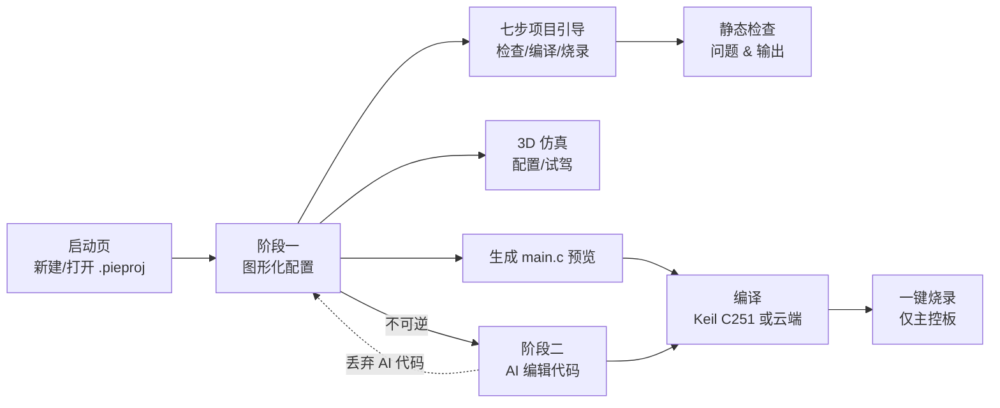

# pie-block

面向 W.PIE RoboMaster 校内赛的机器人控制程序生成器。

用户大多是做机械结构的大一学生，没有编程基础。他们在图形化界面里描述自己的
机器人——引脚接了什么、按键怎么映射、工程模式如何切换——程序在后台生成可直接
编译的 STC32G `main.c`，再交给外置 Keil C251 或云端编译服务编译成 hex，一键烧录
进主控板。

## 它解决什么问题

传统流程里，从「改一行参数」到「板上跑起来」要经过：写代码 → 装 Keil → 编译 →
开 STC-ISP → 选芯片型号 → 上电时序 → 物理接触设备。每一环都足以劝退没有编程基础
的学生。

pie-block 把这条链路压缩成：

```
图形化配置 → 静态检查 → 3D 仿真试跑 → 一键编译 → 一键烧录
```

- 配置用中文下拉框和开关描述，不写一行代码
- 静态检查在生成前拦住引脚冲突、数值越界等几十类错误
- 3D 仿真在烧录前就能「开一开」这台车
- 编译交给外置 Keil C251，或上传到云端编译服务（本机免装 Keil）
- 烧录走自建 bootloader 的 IAP 协议，点一下按钮，无需断电、无需按复位键

## 总体流程



项目文件 `.pieproj` 是自包含的 JSON 单文件，拷给同学即可打开。阶段一 → 阶段二
单向推进，唯一代价是丢弃 AI 编辑的代码。

## 功能总览

### 项目管理

- 启动页新建 / 打开项目，最近打开列表自动摘除损坏条目
- 四种项目类型：**步兵、工程、调试、音乐**，新建时定死、不可转换，类型决定可见标签页
- 配置快照通用序列化：遍历配置区所有控件，key 用相对节点路径，加新控件无需改代码
- 两阶段状态机：阶段二在图形化界面是只读预览，改动会先整份回滚再弹确认
- 未保存提醒、脏标记标题（`* 项目名 · 构型 · 阶段`）

相关文件：`scripts/project_file.gd`、`scripts/launcher.gd`、`scripts/app_state.gd`

### 图形化配置与静态检查

- **七步项目引导**：强制确认只烧录主控板 → 输入配置 → 执行机构配置 → 检查与仿真
  → 编译 → 烧录 → 真机低速测试；图形化页与 AI 编辑页共用同一套引导
- 检查 / 编译 / 烧录状态按当前代码 SHA-256 记录，配置变化后旧结果自动失效；
  完成状态保存在 `.pieproj` 里，拷贝、重开项目后继续显示
- 步兵：遥控器通道 / 死区、底盘四轮 IO 与方向、云台 Yaw/Pitch（舵机或电机）、
  摩擦轮 P64/P66、单发拨弹、按键映射、云台归中角；不提供辅助 IO 或多模式映射
- 工程：8 个扩展板引脚 + 主控板 MP03/MP74 的驱动类型，右摇杆与 A/B/C/D/方向键
  自由映射到任意 IO；支持 1～4 个独立模式、单击轮换或一一对应切换，以及
  增量 / 直接 / 速度 / 增速四种输出方式
- 调试：逐引脚自检序列，每步 3 秒、蜂鸣器提示前后音
- 音乐：Windows 桌面端导入 `.mid/.midi`，选择一条或多条轨道后解析为旋律；可选四声部 1ms 最短时间片伪复音，使用主控板 P33
  蜂鸣器自动循环播放；解析结果保存进 `.pieproj`，不依赖原 MIDI 文件
- 静态检查覆盖数值越界、引脚重复占用、MP74/MP03 只能驱动舵机、按键冲突、
  摩擦轮引脚被挪用等几十条规则，Error / Warn 分级着色

相关文件：`scripts/ui.gd`、`scripts/output.gd`

### 代码生成

四个生成器共用 `scripts/codegen/codegen_base.gd` 的引脚映射、按键宏映射、
舵机占空比换算：

| 生成器 | 说明 |
| --- | --- |
| `codegen_infantry.gd` | 步兵整车（底盘 / 云台 / 摩擦轮 / 单发拨弹） |
| `codegen_engineer.gd` | 工程 1～4 模式按键映射式控制与切换反馈 |
| `codegen_debug.gd` | 引脚自检 |
| `codegen_music.gd` | MIDI 旋律与四声部最短时间片伪复音，P33 蜂鸣器 PWM 自动循环 |

工程模式内的执行机构映射相互独立；切换键冲突在静态检查阶段拦截，切换成功后通过
蜂鸣器音阶反馈当前模式。所有扩展板 IO 输出走 `ExpansionBoradControl`，不用
`PWM_*`。

生成代码适配 Keil C251 的约束：C89 变量声明位置、`math.h` 无 C99 后缀函数、
单函数段 128 字节上限（中间结果用 `static float xdata`）、16 位 int 不提升
（角度→占空比换算在生成期完成）。

### 3D 仿真

- **步兵整车仿真**（`scripts/infantry_sim.gd`）：控制语义逐字复现生成的 C 主循环，
  含单发拨弹的阻塞停顿、摩擦轮渐变、弹丸抛物线（Jolt 物理，1 单位 = 1 米）。
  支持 PC 手柄与键盘代打，云台标定结果可回填配置界面

### 编译工具链

- 本地编译用用户指定的外置 Keil C251；也可选云端编译，本机无需安装 Keil
- 图形化页与 AI 编辑页共用 `BuildController`，统一项目部署、写盘、后台编译与日志
- 优先调用 `uVision.com`（控制台子系统，不弹窗抢焦点），`UV4.exe` 作回退
- 编译走独立线程，日志接进输出框；成功判据是日志中的 `0 Error(s)`（退出码不可靠）

相关文件：`scripts/toolchain.gd`

### 主控板烧录

- 日常烧录走自建 bootloader 的 IAP 协议，不需要断电或按复位键
- 图形化页与 AI 编辑页共用 `DownloadController`，统一串口选择、下载线程与失败提示
- 自动识别 USB / 蓝牙串口，失败时按端口、连接、擦除、写入、校验阶段给排查建议
- 烧录入口与向导明确限制为主控板；**机械扩展板绝不能烧录**
- 新主控板首次仍需由维护者通过 ROM ISP 安装 bootloader

### AI 代码编辑（阶段二）

- 内嵌 ttyd + WRY WebView，在程序窗口里跑 AI Agent 的原生 TUI（中文输入正常）
- 复用七步项目引导，可在 AI 编辑页直接编译、一键烧录，无需返回配置页
- 工作区 = `user://stc32g/`，AI 能读到 `Libraries` 头文件；自动注入
  `assets/templates/AGENTS_hardware.md` 说明硬件约束
- 磁盘 `main.c` 是唯一真相源：手工编辑打脏标记、发消息前落盘，AI 改完比对 mtime 回读
- C 语法高亮（`scripts/c_highlighter.gd`），进程生命周期显式清理，退出无孤儿进程

相关文件：`scripts/code_edit.gd`、`scripts/agent_terminal.gd`

### 测试

headless 脚本，跑法 `godot --headless --path . --script scripts/test_xxx.gd`：

| 脚本 | 覆盖范围 |
| --- | --- |
| `test_project_file.gd` | 项目文件往返、配置序列化、全链路生命周期 |
| `test_sim_remote_input.gd` | 步兵/工程共享的键盘与手柄遥控器映射 |
| `test_infantry_sim.gd` | 步兵仿真几何与控制方向一致性 |
| `test_codegen_mode_feedback.gd` | 工程 1～4 模式、两种切换策略与蜂鸣反馈 |
| `test_static_checker.gd` | 工程跨模式按键冲突及其他配置红线 |
| `test_upgrade_ui.gd` | 升级进度面板状态与重试 |
| `test_flasher_hid.gd` | USB-HID 烧录核心（与 pie_block_hid.py 逐字节等价，向量由 Python 生成） |

## 目录速览

```
pie-block/
├── scenes/              Godot 场景（启动页 / 主界面 / AI 编辑 / 仿真…）
├── scripts/             GDScript：UI、代码生成、工具链、仿真、测试
│   └── codegen/         三个代码生成器 + 公共基类
├── stc32g/              STC32G 固件工程与工具链
│   ├── Projects/        各构型 Keil 工程 + 自建 bootloader
│   ├── Libraries/       板级支持库（只读）
│   └── toolchain/       stcflash 工具、指令模拟器差分测试
├── keil_server/         云端 Keil C251 编译服务（FastAPI + NSSM 部署）
├── assets/templates/    AI 工作区注入的硬件约束模板
└── docs/                指南与技术文档
```

## 开发

```powershell
# 运行
godot --path .

# 跑单个测试
godot --headless --path . --script scripts/test_project_file.gd

# 首次装 WRY 插件后必须导入一次，否则 WebView 类未注册
godot --headless --import
```

`user://` 位置：编辑器模式 `%APPDATA%\Godot\app_userdata\新建游戏项目\`，
导出后 `%APPDATA%\新建游戏项目\`。

硬件约束与踩坑记录见 [docs/STC32G固件约束.md](docs/STC32G固件约束.md)，文档索引见 [docs/](docs/)。
