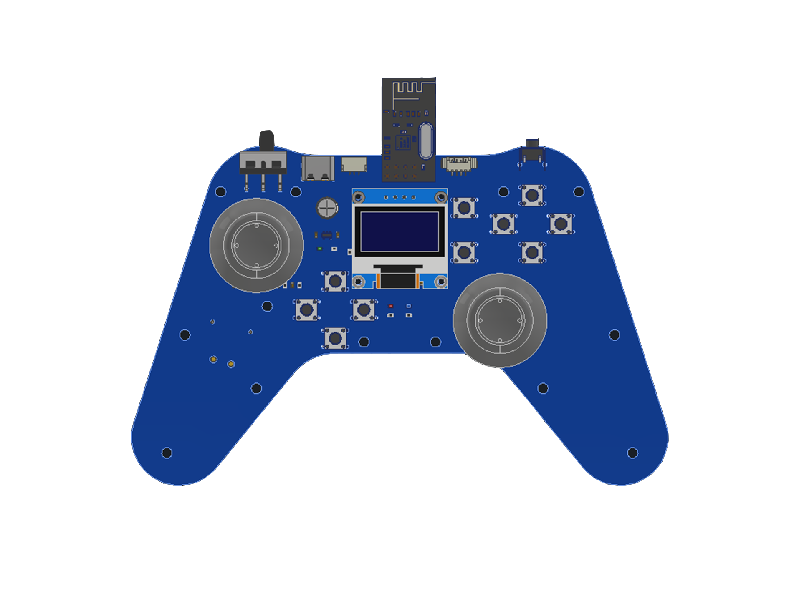
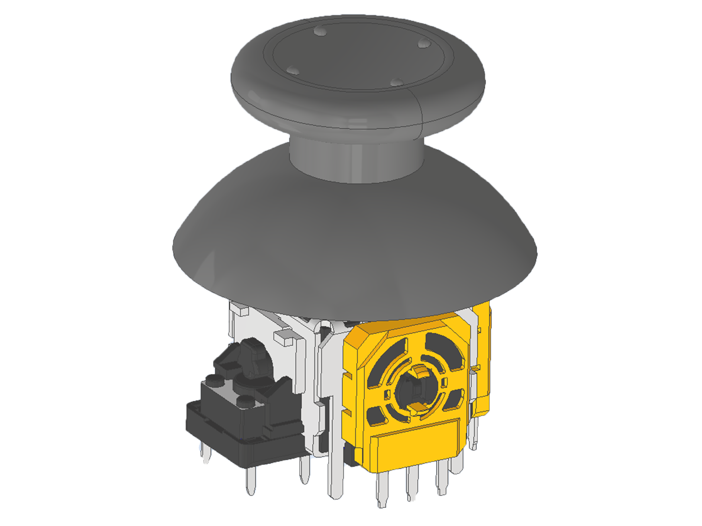
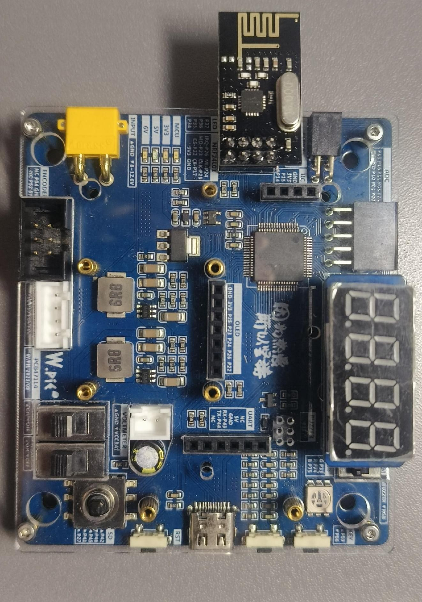
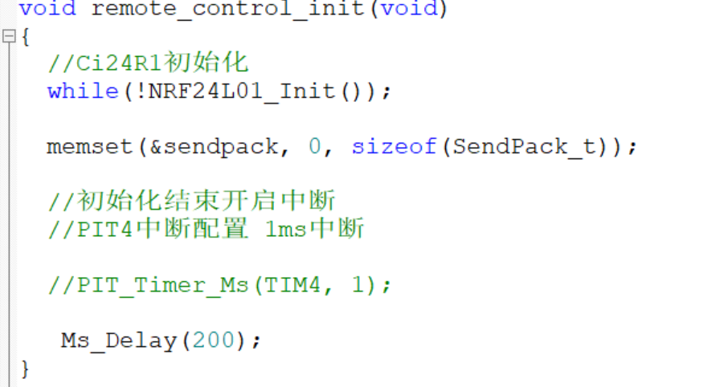
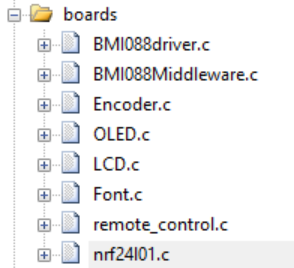
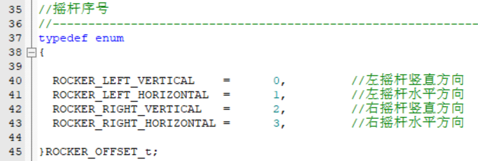
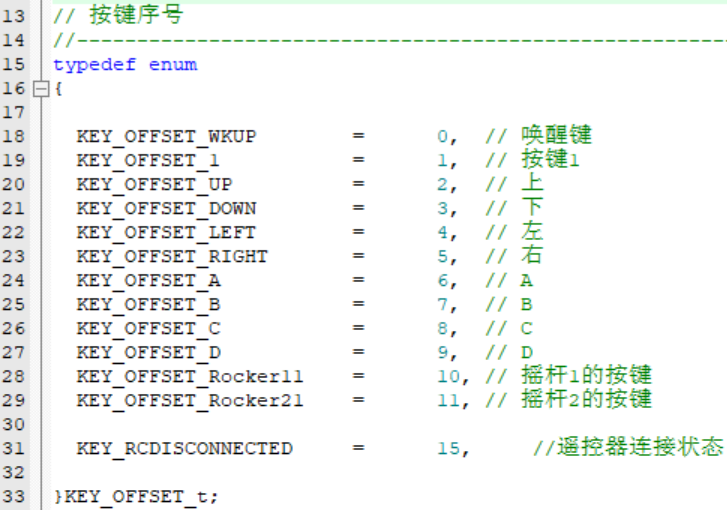
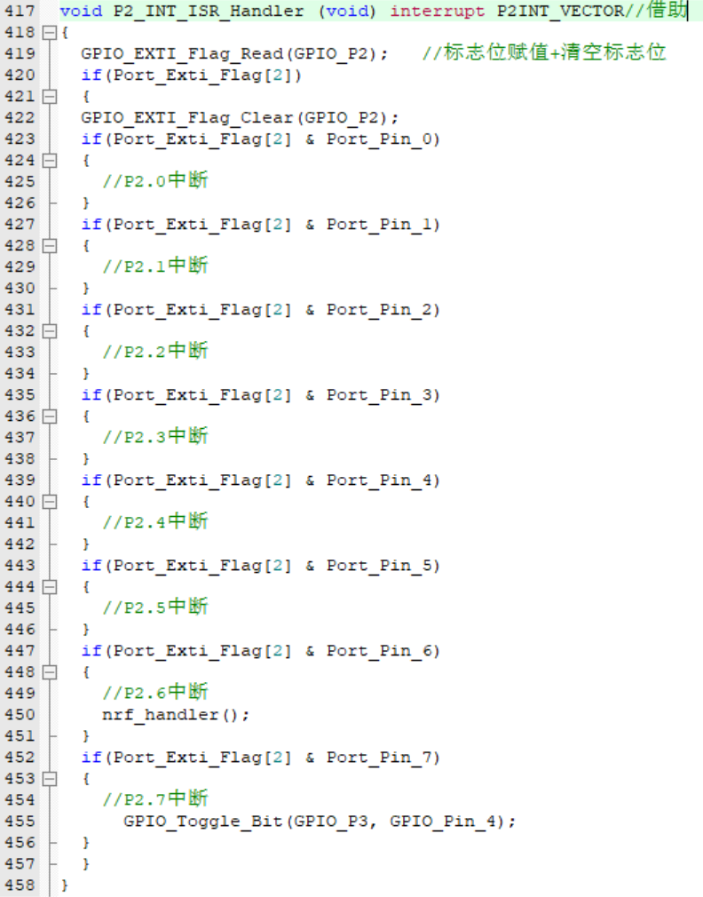

# 智能交互手柄

---

## 幻灯片 1

## 智能交互手柄
- 主讲人
- 菜菜
---

## 幻灯片 2

- 目录
- 结构
- 原理
- 使用
---

## 幻灯片 3

- 01
- 结构
---

## 幻灯片 4

## 介绍

## usb充电口
## 开关
## 双摇杆
## 操作灵活
## 独特PCB设计
## 持握舒适
## 更多按键
## 更多选择
---

## 幻灯片 5

- 02
- 原理
---

## 幻灯片 6

## 遥控器使用NRF24L01芯片
## 采用SPI通信协议
## 模块自由：同频内自由收发
## 无线模块
---

## 幻灯片 7

## 摇杆

## 单个摇杆两路ADC检测
## 12bit检测精度
## 左-右 / 上-下
## 数值为2047->  -2047
## 开机自动归一化校准
---

## 幻灯片 8

- 03
- 使用
---

## 幻灯片 9

## 安装接收端
---

## 幻灯片 10

- 程序
## 遥控器相关程序在：remote_control.c
## remote_control.h
## nrf24l01.h
---

## 幻灯片 11

- 程序
### 手柄初始化：remote_control_init();
### 设置通信频道：#define CHANAL        1

### 通道号怎么找？遥控器开机后长按mode按钮

---

## 幻灯片 12

## 通道号怎么看？
## 通道号
## 长按mode按键直到跳转至这个页面
---

## 幻灯片 13

- 读取手柄摇杆状态
- RcRockerKeyValueRead(  );
- 位置：

- 所用引脚位置：

---

## 幻灯片 14

- 读取手柄按键状态
- RcKeyValueRead(  );
- 位置：

- 所用引脚位置：

---

## 幻灯片 15

- 注意事项
## 强调：
## nrf24I01.c库里面的这个中断
## 不能改，不能改，不能改，
## 不能注释，不能注释，不能注释
## 请保留最初始的样子

---

## 幻灯片 16

- 使用遥控器
- 初始化：
- remote_control_init();    记得通道号！！在nrf24I01.c库里
- 读取：
- RcKeyValueRead(  );——读取按键状态
- RcRockerKeyValueRead(  )——读取摇杆状态